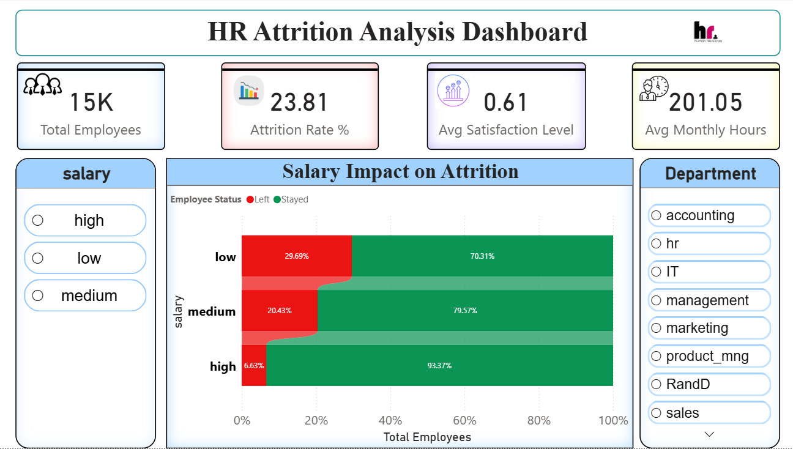
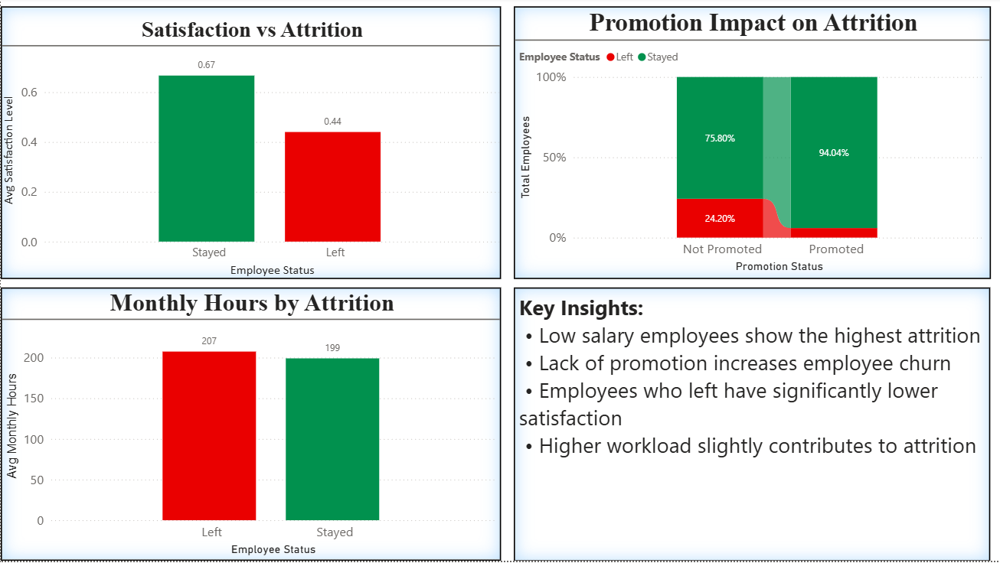

# 🏢 HR Attrition  Analysis Dashboard

## 📌 Overview
This dashboard provides a comprehensive analysis of HR attrition data, highlighting employee retention patterns, salary and promotion impact, job satisfaction trends, and workload distribution. The dashboard is **interactive**, enabling users to filter data through slicers, explore KPIs, and visualize attrition trends across different dimensions.

## 🛠 Tools Used
- Microsoft Power BI (for visualization and dashboard creation)  
- Excel (`HR_capstone_dataset.xlsx`) for data cleaning and preparation  
- Python (Pandas & NumPy) for data cleaning, preprocessing, and exploratory analysis  

## 🖥 Dashboard Features
- **KPI Cards:** Quick overview of total employees, attrition rate, average satisfaction, and average monthly hours  
- **Slicers:** Filter by salary and department for detailed analysis  
- **Interactive Charts:** Analyze salary impact, satisfaction vs attrition, promotion effect, and monthly hours distribution  
- **Insights-driven Layout:** Designed to highlight the most critical factors influencing employee attrition  

## 📊 Key Insights
1. **Salary Impact:**  
   - Employees with **low salary** show the **highest attrition**  

2. **Promotion Effect:**  
   - **Lack of promotion** increases employee churn  

3. **Job Satisfaction:**  
   - Employees who left have **significantly lower satisfaction**  

4. **Workload Impact:**  
   - **Higher workload** slightly contributes to attrition  

## 📸 Dashboard Preview
  
  

## 🔗 Interactive Dashboard
Download the `.pbix` file and open it in Power BI Desktop to explore full interactivity — slicers, KPI cards, and charts are fully functional.  

## 📁 Files Included
- `Hedataset.pbix` → Power BI dashboard file  
- `HR_capstone_dataset.xlsx` → Dataset used for analysis  

## 🚀 Skills Demonstrated
- Data Cleaning & Preprocessing using Python  
- Data Visualization & Dashboard Design in Power BI  
- KPI & Metrics Analysis  
- Insight Generation for HR Decision-making